# Manual Testing

[Main README.md](README.md)

I used Google Dev Tools lighthouse to test performance and accessibility of the website

### Epic 1 - Core website functionality
1. As a site user I can find a navigation bar and footer so that I can see what content there is on the website.

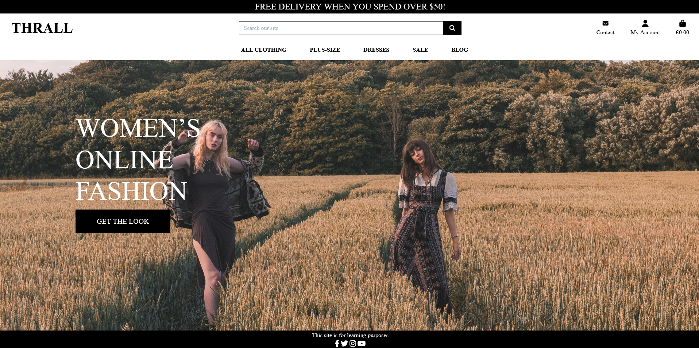

2. As a site user, I can see important information on the website's home page so that I don’t have to search the website for that information.

3. As a site user I can easily navigate through the website so that I can find the content I need.

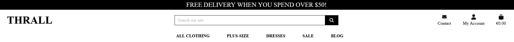

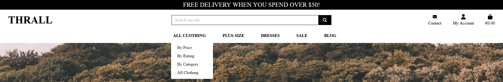

4. As a site user I want to see icons for the website's social media pages so that I can follow Thrall on different platforms.

### Epic 2 - Superuser Access 
5. As a superuser, I can create, remove, update or delete product items from the database so that I can ensure the product items are accurate and that the catalog of items is fully up-to-date.

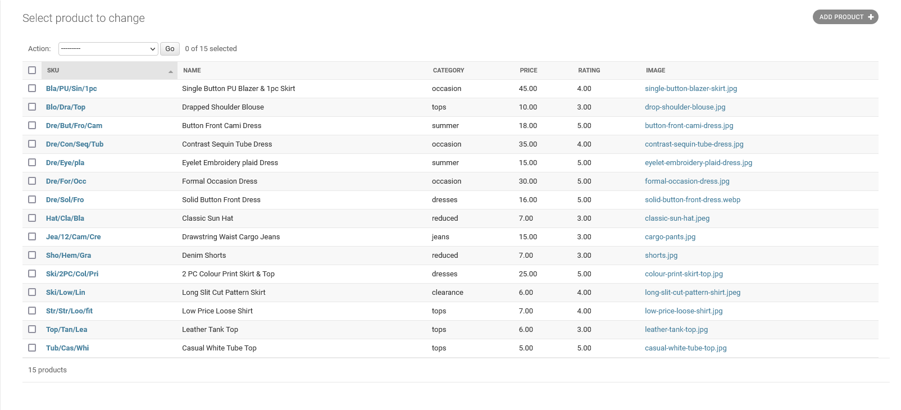

6. As a superuser I can log in so that I can and access the backend of the website.

### Epic 3 - Authenticated User Experience
7. As a logged-in user, I want to save my details so that I can have my information saved and manage my shopping.

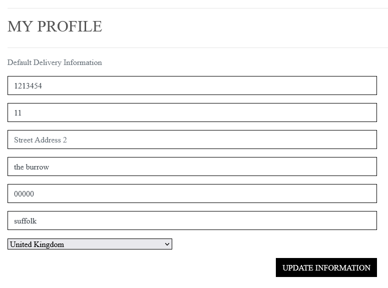

8. As a logged-in user, I can see a clear visual indication of my login status so that I can choose to be logged in or out.

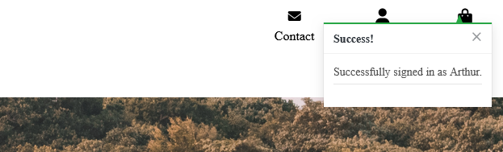

9.  As a logged-in user, I can view my past orders, so that I can verify what my previous order was and view the order number.

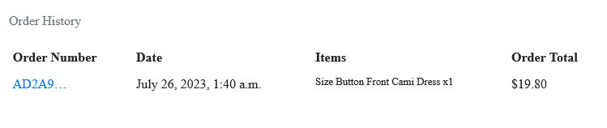

10.  As a logged-in user I can rate and review products so that I can give feedback to the website and other customers.

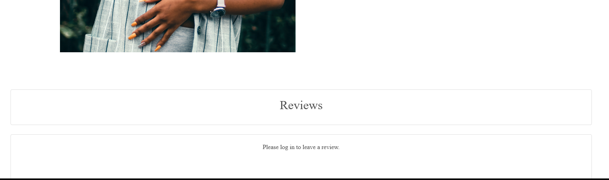

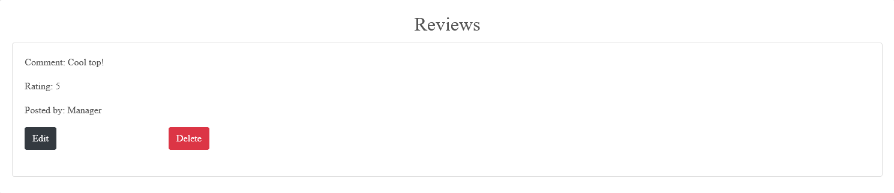

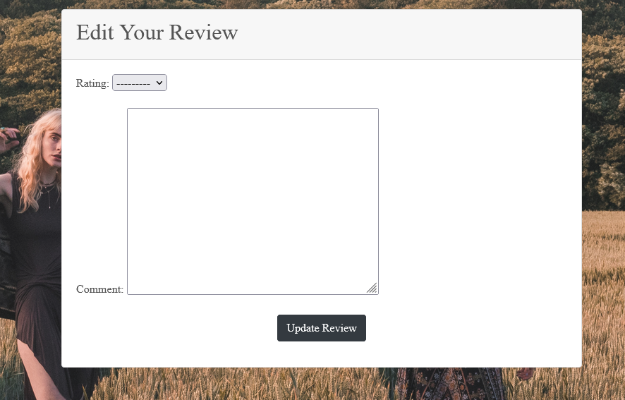

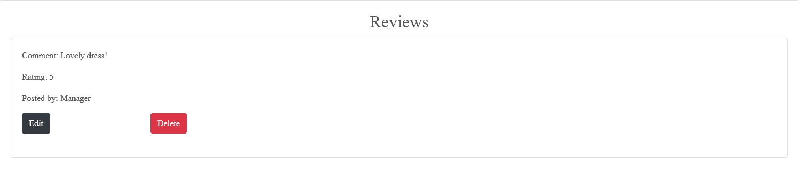

### Epic 4: Product Information
11. As a site user I can read detailed information about each product, including images, descriptions, sizes, and prices so that I can make an informed choice.

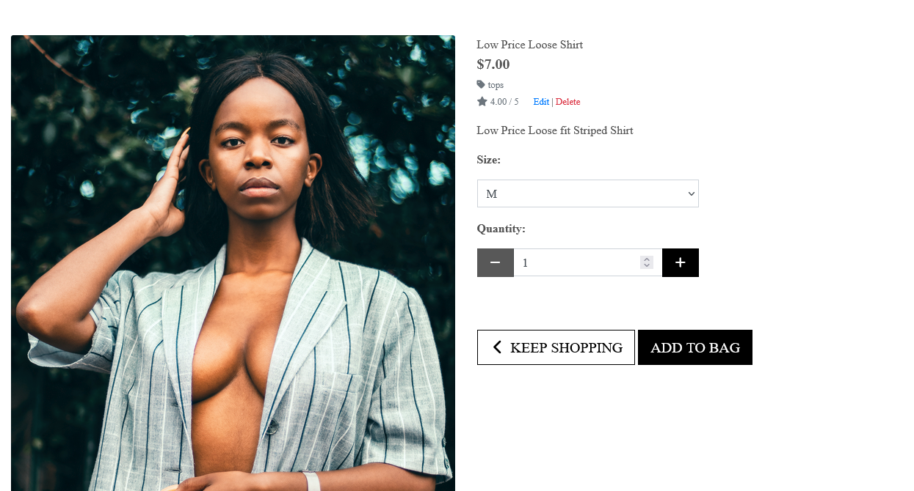

### Epic 5: Shopping Cart and Checkout
12.  As a shopper I can use a seamless and user-friendly checkout process so that enter shipping and payment information quickly and securely.

13.  As a shopper I can add, remove, update or delete items from my cart so that manage my shopping cart.

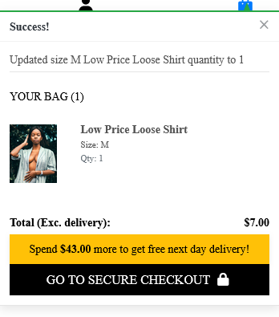

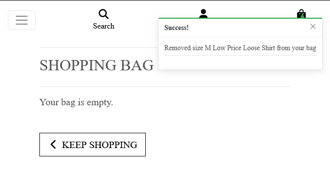

14.  As a shopper I can see a confirmation when a product is added to my shopping bag so that I can avoid accidentally adding multiple quantities of the same item.
15.  As a shopper I can view the contents of my bag so that see the items that I am purchasing

### Epic 6: Product Catalog and Search
16. As a site user I can easily browse through a wide variety of trendy and affordable clothing options so that I know what is available.

17. As a site user I can use search filters so that find the item I am looking for.

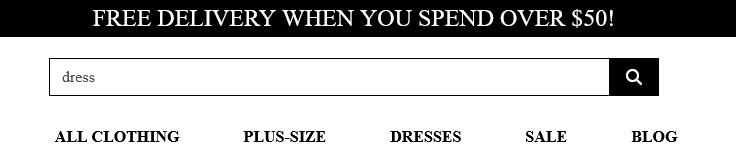

### Epic 7: Customer service 
18.  As a site user, I want to have access to a frequently asked questions (FAQ's) page so that I can seek out more information about Thrall.

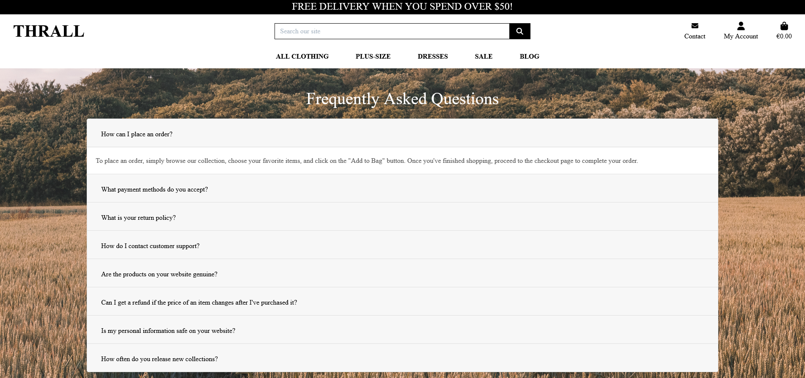

### Epic 8: Read Articles 
19. As a site user I can read engaging articles about Thrall's product items so that be up-to-date on the latest styles.

